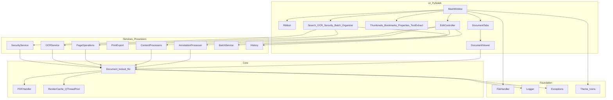

# PDFMaster

**Professional PDF viewer & editor for Windows — v0.7.0**

[](https://github.com/Remo-Consultants/pdfmaster/releases/latest)
[](LICENSE)
[](https://www.python.org/downloads/)
[](https://github.com/Remo-Consultants/pdfmaster/actions/workflows/ci.yml)

Offline-first desktop app for opening, reading, annotating, editing, securing, and batch-processing PDFs. Files never leave your machine.

**Product page:** https://remo-consultants.github.io/pdfmaster/ · **Quick start:** [`QUICKSTART.md`](QUICKSTART.md) · **Install guide:** [`INSTALL.md`](INSTALL.md)

---

## Install and run (choose one)

### Option A — Windows Setup.exe (recommended)

1. Open the [latest release](https://github.com/Remo-Consultants/pdfmaster/releases/latest)
2. Download **`PDFMaster-*-Setup.exe`** from the latest release
3. Run the installer → Start Menu / desktop shortcut
4. Launch **PDFMaster** → **Ctrl+O** to open a PDF

### Option B — Portable ZIP

1. Download **`PDFMaster-*-win64.zip`** from the same release
2. Extract anywhere and run **`PDFMaster.exe`**
3. No admin install required

### Option C — From source (developers)

```powershell
git clone https://github.com/Remo-Consultants/pdfmaster.git
cd pdfmaster
python -m venv venv
.\venv\Scripts\activate
pip install -r requirements.txt
python -m src.main
```

Linux/macOS: use `source venv/bin/activate` instead of the Scripts path.

### Build the Windows packages yourself

```powershell
.\venv\Scripts\activate
pip install pyinstaller
# Optional for Setup.exe:
# winget install NSIS.NSIS
python installer/build_installer.py --clean --nsis
```

Outputs in `dist/`:

| Artifact | Purpose |
| --- | --- |
| `dist/PDFMaster/` | Folder distribution (`PDFMaster.exe`) |
| `dist/PDFMaster-<version>-win64.zip` | Portable ZIP |
| `dist/PDFMaster-<version>-Setup.exe` | NSIS installer (Start Menu + uninstall) |

Full packaging notes: [`INSTALL.md`](INSTALL.md).

---

## What you get

| Area | Capabilities |
| --- | --- |
| **Workspace** | Ribbon (Home / Markup / Edit / Organize / View), multi-document tabs, continuous soft-shadow pages, system light/dark theme, HiDPI SVG icons |
| **View** | Zoom 25–400%, fit width/page, thumbnails (`F9`), bookmarks outline, properties (`F10`) |
| **Markup** | Highlight, underline, strikeout, squiggly, sticky notes, pen, rectangles, eight colours, watermarks & stamps |
| **Edit** | Edit/replace text, add text/images, erase, find/replace, forms, true redaction, flatten |
| **Organize** | Reorder, insert blank, duplicate, delete, rotate, import pages |
| **Print / export** | System print + preview, PNG/JPEG export |
| **History** | Undo / redo (bounded steps & memory) |
| **Phase 3** | Document search (`Ctrl+F`), OCR (`Ctrl+Shift+T`), text extract (`Ctrl+T`), AES password protect, batch compress/extract/convert |
| **Phase 4** | Text watermarks, stamps, document compare, PDF/A inspection |

---

## Design & architecture

PDFMaster is a layered desktop app: the UI never calls PyMuPDF directly. One `Document` owns the open handle under a lock; background render workers and edit processors share that contract.



**Rules of thumb**

- UI → services/core only; no raw `fitz` in widgets.
- Mutations go through `Document.transaction()` so renders and edits stay consistent.
- Failures become typed exceptions → status bar / dialog + rotating log under `~/.pdfmaster/logs/`.
- Saves are atomic: a failed overwrite never leaves a half-written original.

**Stack:** Python 3.10+ · PySide6 (Qt 6) · PyMuPDF · pypdf · Pillow · cryptography

---

## First five minutes

1. **Ctrl+O** — open a PDF  
2. Scroll continuously; click thumbnails or the **Bookmarks** dock to jump  
3. **Markup** tab — highlight a line; **Ctrl+Z** to undo  
4. **Ctrl+F** — search the whole document  
5. **Ctrl+S** — save (or Save As)

More detail: [`QUICKSTART.md`](QUICKSTART.md) · visual overview: [`docs/index.html`](docs/index.html)

### Everyday shortcuts

| Action | Shortcut |
| --- | --- |
| Open / Save / Quit | `Ctrl+O` / `Ctrl+S` / `Ctrl+Q` |
| Search / Extract text / OCR | `Ctrl+F` / `Ctrl+T` / `Ctrl+Shift+T` |
| Undo / Redo | `Ctrl+Z` / `Ctrl+Y` |
| Thumbnails / Properties | `F9` / `F10` |
| Print / Find-replace | `Ctrl+P` / `Ctrl+H` |
| Primary tools | `1`–`9` |

---

## Project layout

```
pdfmaster/
├── src/
│   ├── main.py                 # Entry point
│   ├── constants.py            # Version, shortcuts, limits
│   ├── core/                   # Document, PDFHandler
│   ├── processors/             # Annotations, content, pages, forms…
│   ├── services/               # Print, OCR, security, batch, history
│   └── ui/                     # MainWindow, ribbon, viewer, dialogs, docks
├── tests/                      # pytest + pytest-qt (259 tests)
├── installer/                  # build_installer.py, pdfmaster.nsi
├── resources/icons/            # App icon (.png / .ico)
├── docs/index.html             # Styled product page
├── pdfmaster.spec              # PyInstaller
├── INSTALL.md                  # Install & packaging
└── QUICKSTART.md               # Five-minute guide
```

---

## Development & tests

```powershell
.\venv\Scripts\activate
pip install -r requirements.txt
$env:QT_QPA_PLATFORM = "offscreen"
python -m pytest tests/ -q
```

Headless GUI tests use `pytest-qt` with a 60s timeout and auto-cancelled dialogs.

---

## Requirements

| | Minimum | Recommended |
| --- | --- | --- |
| OS | Windows 10 64-bit | Windows 11 |
| Python (source) | 3.10 | 3.11–3.13 |
| RAM | 4 GB | 8 GB+ |

OCR is optional: install [Tesseract](https://github.com/tesseract-ocr/tesseract) or `easyocr` if you use **Tools → OCR**.

---

## Roadmap

| Phase | Status |
| --- | --- |
| MVP view / zoom / rotate / save | Shipped (0.1) |
| Markup, edit, organize, print, undo | Shipped (0.2–0.3) |
| Ribbon + multi-doc tabs | Shipped (0.4) |
| Search, OCR, security, batch, installer | Shipped (0.5) |
| Watermarks & stamps | Shipped (0.6) |
| Document compare & PDF/A check | Shipped (0.7) |
| Signatures, cloud, visual diff | Ideas (later) |

---

## Changelog (recent)

### 0.7.0 — 2026-09-13

Document compare and PDF/A inspection.

- **Added:** Compare Documents — text diff per page vs another PDF (Tools menu)
- **Added:** PDF/A Check — declaration, part/conformance, OutputIntent, findings
- **Changed:** Package version bumped to 0.7.0

### 0.6.0 — 2026-09-13

Phase 4 start: watermarks and stamps.

- **Added:** Text watermarks across all / current / ranged pages (opacity, angle, size)
- **Added:** Rubber stamps with presets (DRAFT, CONFIDENTIAL, APPROVED, …) and custom text
- **Added:** Image stamps for logos / signature images
- **Added:** Markup ribbon **Stamp** group; Tools → Watermark / Stamp
- **Changed:** Package version bumped to 0.6.0

### 0.5.0 — 2026-09-12

Search (`Ctrl+F`), OCR, text extract (`Ctrl+T`), bookmarks, AES password protection, batch processing, PyInstaller + NSIS packaging, product docs.

### 0.4.0 — 2026-09-12

Ribbon workspace, multi-document tabs, soft page shadows, HiDPI SVG icons.

Older entries: see git history and prior release notes.

---

## License & credits

MIT — see [LICENSE](LICENSE).

Built with [PySide6](https://doc.qt.io/qtforpython/), [PyMuPDF](https://pymupdf.readthedocs.io/), [pypdf](https://pypdf.readthedocs.io/), and [Pillow](https://python-pillow.org/).

PDFMaster is independent and not affiliated with Adobe, Microsoft, or the PDF Association.

---

## Support

1. [`INSTALL.md`](INSTALL.md) / [`QUICKSTART.md`](QUICKSTART.md)  
2. Log: `~/.pdfmaster/logs/pdfmaster.log`  
3. [GitHub Issues](https://github.com/Remo-Consultants/pdfmaster/issues)
