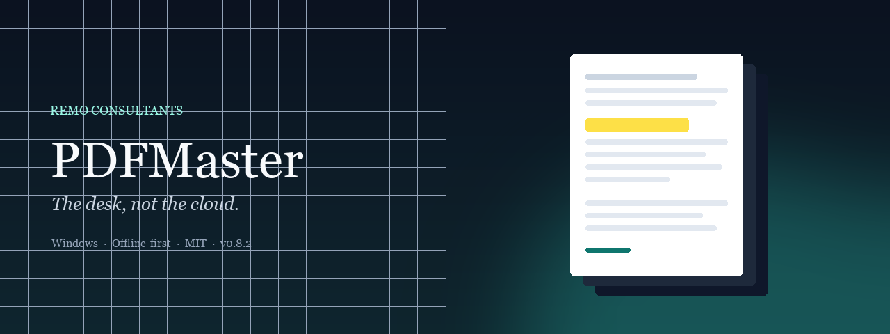
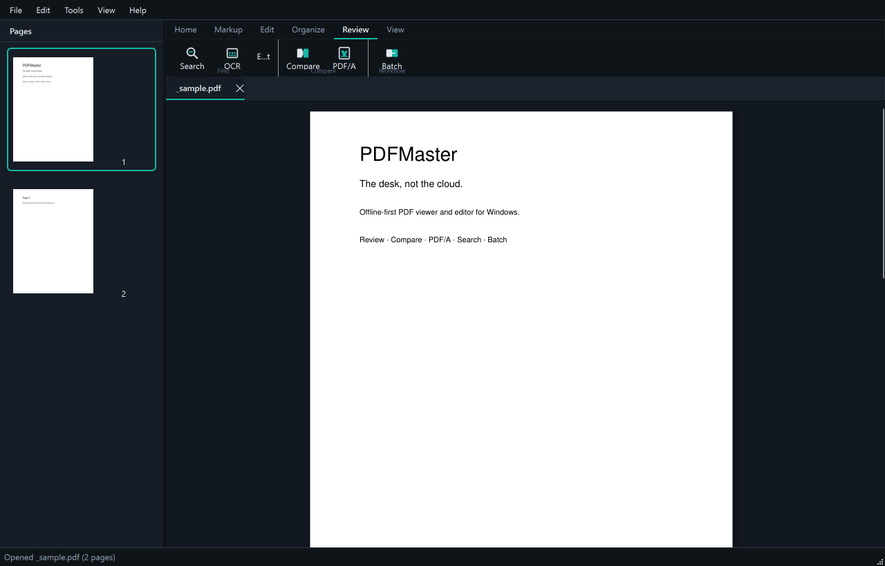
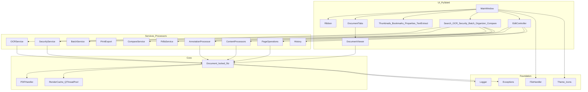

<p align="center">
  
</p>

<p align="center">
  <strong>Professional PDF viewer &amp; editor for Windows</strong><br/>
  Offline-first · Ribbon workspace · True redaction · MIT
</p>

<p align="center">
  <a href="https://github.com/Remo-Consultants/pdfmaster/releases/latest"></a>
  <a href="LICENSE"></a>
  <a href="https://www.python.org/downloads/"></a>
  <a href="https://github.com/Remo-Consultants/pdfmaster/actions/workflows/ci.yml"></a>
  
</p>

<p align="center">
  <a href="https://remo-consultants.github.io/pdfmaster/">Product page</a> ·
  <a href="INSTALL.md">Install guide</a> ·
  <a href="QUICKSTART.md">Quick start</a> ·
  <a href="REFLECTION.md">Product reflection</a> ·
  <a href="PRESS.md">Press kit</a>
</p>

> **You are here:** product overview & architecture. Detailed install → [`INSTALL.md`](INSTALL.md). First-run walkthrough → [`QUICKSTART.md`](QUICKSTART.md).

---

## Why PDFMaster

Adobe and Foxit built empires on the PDF. They also built **subscriptions, cloud defaults, and interfaces that treat your documents as inventory**.

PDFMaster is the counter-offer:

| | PDFMaster | Typical commercial suite |
| --- | --- | --- |
| **Where files live** | On your PC. Always. | Often nudged toward the cloud |
| **Cost to own** | Free (MIT) | Subscription or perpetual SKU |
| **Workspace feel** | Commercial ribbon, multi-doc tabs, soft page shadows | Feature-dense, sometimes heavy |
| **Privacy model** | Offline-first by design | Account, telemetry, sync layers |
| **Redaction** | True content removal | Varies by product tier |
| **Openness** | Source you can read and ship | Closed binary |

**The desk, not the cloud.** Open a PDF. Mark it up. Protect it. Compare it. Ship it. Your documents never leave the machine unless you send them.

> Full product philosophy → [`REFLECTION.md`](REFLECTION.md)

---

## Install

1. **Setup.exe** — download from the [latest release](https://github.com/Remo-Consultants/pdfmaster/releases/latest), run the installer, launch PDFMaster  
2. **Portable ZIP** — extract `PDFMaster-*-win64.zip` and run `PDFMaster.exe`  
3. **From source / build packages** — see [`INSTALL.md`](INSTALL.md)

After install, follow [`QUICKSTART.md`](QUICKSTART.md) for first-run steps.

---

## The workspace

PDFMaster is composed like a commercial desktop product — not a thin wrapper around a PDF library.

<p align="center">
  
</p>

- **Ribbon** — Home / Markup / Edit / Organize / **Review** / View with labelled groups and HiDPI SVG icons (matches the [product page](https://remo-consultants.github.io/pdfmaster/) tab names — the site is marketing, the app is the real UI)
- **Tabs** — each open PDF keeps its own zoom, page, and undo history
- **Theme** — follows Windows light/dark instantly; no restart
- **Canvas** — continuous scrolling with soft page shadows so edges stay readable

---

## Capabilities

| Area | What you can do |
| --- | --- |
| **View** | Zoom 25–400%, fit width/page, thumbnails (`F9`), bookmarks outline, properties (`F10`) |
| **Markup** | Highlight, underline, strikeout, squiggly, sticky notes, pen, rectangles, eight colours |
| **Stamps & watermarks** | Text watermarks (opacity, angle, range); rubber stamps (DRAFT, CONFIDENTIAL…); image stamps |
| **Edit** | Edit/replace text, add text/images, erase, find/replace, fillable forms, flatten |
| **Redact** | **True redaction** — underlying text and images are removed, not painted over |
| **Organize** | Reorder (drag or buttons), reverse, merge PDFs into the open file, insert blank, duplicate, delete, rotate, import pages |
| **Print / export** | System print + preview; PNG/JPEG export up to 600 dpi |
| **Review** | Ribbon tab: Search (`Ctrl+F`), OCR, batch, **Compare**, **PDF/A** (plus Tools menu for power users) |
| **Search & OCR** | Document search (`Ctrl+F`); OCR scanned pages (`Ctrl+Shift+T`); text extract (`Ctrl+T`) |
| **Security** | AES password protect / remove; security info; place signature fields |
| **Batch** | Compress, extract, convert a folder of PDFs |
| **Compare** | Page-by-page text diff; optional rendered-page similarity |
| **PDF/A** | Desktop inspection of declarations, part/conformance, OutputIntent, findings |
| **History** | Bounded undo / redo (steps + memory) |

---

## First five minutes

1. **Ctrl+O** — open a PDF  
2. Scroll continuously; use thumbnails or **Bookmarks** to jump  
3. **Markup** tab — highlight a line; **Ctrl+Z** to undo  
4. **Ctrl+F** — search the whole document  
5. **Ctrl+S** — save (or Save As)

More detail: [`QUICKSTART.md`](QUICKSTART.md) · visual overview: [`docs/index.html`](docs/index.html)

### Everyday shortcuts

| Action | Shortcut |
| --- | --- |
| Open / Save / Quit | `Ctrl+O` / `Ctrl+S` / `Ctrl+Q` |
| Search / Extract text / OCR | `Ctrl+F` / `Ctrl+T` / `Ctrl+Shift+T` |
| Undo / Redo | `Ctrl+Z` / `Ctrl+Y` |
| Thumbnails / Properties | `F9` / `F10` |
| Print / Find-replace | `Ctrl+P` / `Ctrl+H` |
| Organize / Forms / Export | `Ctrl+Shift+O` / `Ctrl+Shift+F` / `Ctrl+Shift+E` |
| Primary tools | `1`–`9` |

---

## Architecture

UI never talks to PyMuPDF directly. `Document` owns the open handle; processors and services mutate under lock.

PDFMaster is a **layered** desktop app: the UI never calls PyMuPDF directly. One `Document` owns the open handle under a lock; background render workers and edit processors share that contract.



**Engineering principles**

- **UI → services/core only** — no raw `fitz` in widgets
- **Mutations go through `Document.transaction()`** — renders and edits stay consistent
- **Typed failures** — status bar / dialog + rotating log under `~/.pdfmaster/logs/`
- **Atomic saves** — a failed overwrite never leaves a half-written original
- **Bounded caches** — render and undo memory are capped so large pages stay manageable

**Stack:** Python 3.10+ · PySide6 (Qt 6) · PyMuPDF · pypdf · Pillow · cryptography

---

## Project layout

```
pdfmaster/
├── src/
│   ├── main.py                 # Entry point
│   ├── constants.py            # Version, shortcuts, limits
│   ├── core/                   # Document, PDFHandler, history
│   ├── processors/             # Annotations, content, pages, forms, redaction, watermarks
│   ├── services/               # Print, OCR, security, batch, compare, PDF/A
│   └── ui/                     # MainWindow, ribbon, viewer, dialogs, docks
├── tests/                      # pytest + pytest-qt (260+ tests)
├── installer/                  # build_installer.py, pdfmaster.nsi
├── docs/                       # Product page + brand assets
├── REFLECTION.md               # Product manifesto & design ethos
├── PRESS.md                    # Press & PR kit (boilerplate, headlines, assets)
├── INSTALL.md                  # Install & packaging
└── QUICKSTART.md               # Five-minute guide
```

---

## Development & tests

```powershell
.\venv\Scripts\activate
pip install -r requirements.txt
$env:QT_QPA_PLATFORM = "offscreen"
python -m pytest tests/ -q
```

Headless GUI tests use `pytest-qt` with a 60s timeout and auto-cancelled dialogs.

---

## Requirements

| | Minimum | Recommended |
| --- | --- | --- |
| OS | Windows 10 64-bit | Windows 11 |
| Python (source) | 3.10 | 3.11–3.13 |
| RAM | 4 GB | 8 GB+ |

OCR is optional: install [Tesseract](https://github.com/tesseract-ocr/tesseract) or `easyocr` if you use **Tools → OCR**.

---

## Roadmap

| Phase | Status |
| --- | --- |
| MVP view / zoom / rotate / save | Shipped (0.1) |
| Markup, edit, organize, print, undo | Shipped (0.2–0.3) |
| Ribbon + multi-doc tabs | Shipped (0.4) |
| Search, OCR, security, batch, installer | Shipped (0.5) |
| Watermarks & stamps | Shipped (0.6) |
| Document compare & PDF/A check | Shipped (0.7) |
| Visual compare, signature fields | Shipped (0.8) |
| Review ribbon + visible stamps (0.8.1) | Shipped (0.8.1) |
| Organize merge + drag reorder (0.8.2) | Shipped (0.8.2) |
| Cloud *opt-in*, PDF/A conversion | Ideas (later) |

---

## Changelog (recent)

### 0.8.2 — 2026-09-14

Organize tools for merging and reshuffling pages.

- **Added:** **Merge PDFs** on Organize ribbon / Edit menu / Page Organizer (append or insert)
- **Added:** Page Organizer — drag-and-drop reorder, Reverse order, Move to Top / Bottom
- **Changed:** Product site and docs reshuffled (Product → Why → slim Install); README banner uses PNG

### 0.8.1 — 2026-09-14

Make Phase 3/4 tools visible on the ribbon and align docs with the desktop app.

- **Added:** **Review** ribbon tab — Search, OCR, Compare, PDF/A, Batch (large labelled buttons)
- **Changed:** Markup **Stamp** group — Watermark & Stamp with icons and labels
- **Changed:** Window title includes version (`PDFMaster 0.8.1`); welcome screen lists Review/Markup tools
- **Changed:** [Product page](https://remo-consultants.github.io/pdfmaster/) updated to v0.8.1 and six ribbon tabs

### 0.8.0 — 2026-09-14

- **Added:** Compare dialog option — compare rendered page appearance (similarity score)
- **Added:** Tools → Security → Add Signature Field

### 0.7.0 — 2026-09-13

Document compare and PDF/A inspection.

- **Added:** Compare Documents — text diff per page vs another PDF (Tools menu)
- **Added:** PDF/A Check — declaration, part/conformance, OutputIntent, findings
- **Changed:** Package version bumped to 0.7.0

### 0.6.0 — 2026-09-13

Phase 4 start: watermarks and stamps.

- **Added:** Text watermarks across all / current / ranged pages (opacity, angle, size)
- **Added:** Rubber stamps with presets (DRAFT, CONFIDENTIAL, APPROVED, …) and custom text
- **Added:** Image stamps for logos / signature images
- **Added:** Markup ribbon **Stamp** group; Tools → Watermark / Stamp

### 0.5.0 — 2026-09-12

Search (`Ctrl+F`), OCR, text extract (`Ctrl+T`), bookmarks, AES password protection, batch processing, PyInstaller + NSIS packaging, product docs.

### 0.4.0 — 2026-09-12

Ribbon workspace, multi-document tabs, soft page shadows, HiDPI SVG icons.

Older entries: see git history and prior release notes.

---

## Positioning note

PDFMaster is **independent** and not affiliated with Adobe, Foxit, Microsoft, or the PDF Association. We respect the PDF as an open document format and compete on **craft, privacy, and ownership** — not on feature checklists alone.

---

## License & credits

MIT — see [LICENSE](LICENSE).

Built with [PySide6](https://doc.qt.io/qtforpython/), [PyMuPDF](https://pymupdf.readthedocs.io/), [pypdf](https://pypdf.readthedocs.io/), and [Pillow](https://python-pillow.org/).

---

## Support

1. [`INSTALL.md`](INSTALL.md) / [`QUICKSTART.md`](QUICKSTART.md) / [`REFLECTION.md`](REFLECTION.md) / [`PRESS.md`](PRESS.md)  
2. Log: `~/.pdfmaster/logs/pdfmaster.log`  
3. [GitHub Issues](https://github.com/Remo-Consultants/pdfmaster/issues)
